# Architecture — yanatech.co.uk Homelab

> **Last verified:** June 2026  
> **Cluster version:** Kubernetes v1.32.13 (kubeadm) — Ubuntu 24.04.4 LTS — containerd 2.2.4

---

## Table of Contents

1. [Overview](#1-overview)
2. [Physical Infrastructure](#2-physical-infrastructure)
3. [Kubernetes Cluster](#3-kubernetes-cluster)
4. [Networking](#4-networking)
5. [Storage](#5-storage)
6. [Secret Management](#6-secret-management)
7. [GitOps & CI/CD](#7-gitops--cicd)
8. [Platform Services](#8-platform-services)
9. [Applications](#9-applications)
10. [yana-stocks Architecture](#10-yana-stocks-architecture)
11. [Observability](#11-observability)
12. [Deployment Patterns](#12-deployment-patterns)
13. [Backup & Recovery](#13-backup--recovery)

---

## 1. Overview

A self-hosted, production-grade homelab running on a 6-node Kubernetes cluster across 3 Proxmox hypervisors. The cluster is managed entirely via GitOps (ArgoCD) — nothing is deployed manually without a subsequent commit to `github.com/akann/k8s-apps`.

**Design principles:**

- GitOps-first: git is the single source of truth
- Zero-trust networking: every namespace has `default-deny-all` NetworkPolicy
- Secrets never in git: all secrets pulled from Infisical via External Secrets Operator
- Single wildcard TLS cert reflected to all namespaces via Reflector
- SSO on all web UIs via Authentik

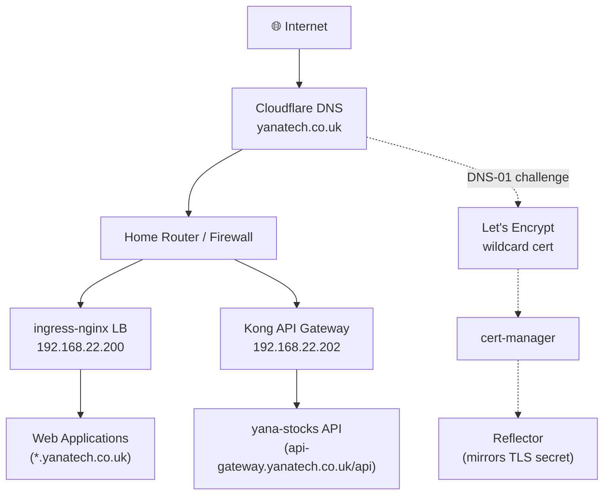

---

## 2. Physical Infrastructure

### 2.1 Proxmox Hypervisors

| Host | IP            | Role                          |
| ---- | ------------- | ----------------------------- |
| pve1 | 192.168.22.11 | Proxmox hypervisor + Ceph OSD |
| pve2 | 192.168.22.12 | Proxmox hypervisor + Ceph OSD |
| pve3 | 192.168.22.13 | Proxmox hypervisor + Ceph OSD |

All Kubernetes VMs run as Proxmox guests. Ceph monitors are co-located on the Proxmox hosts at `192.168.22.11-13:6789`.

### 2.2 Physical Topology

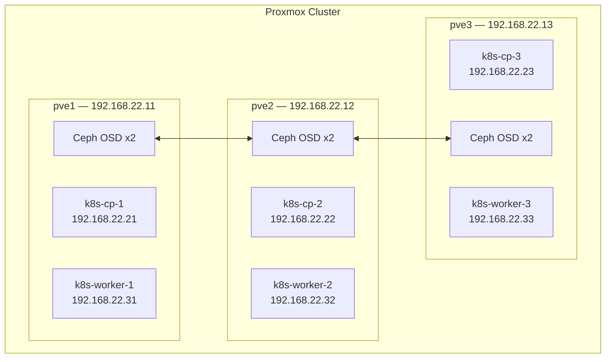

---

## 3. Kubernetes Cluster

### 3.1 Nodes

| Node         | Role          | IP            | OS                 | K8s Version | CRI              |
| ------------ | ------------- | ------------- | ------------------ | ----------- | ---------------- |
| k8s-cp-1     | control-plane | 192.168.22.21 | Ubuntu 24.04.4 LTS | v1.32.13    | containerd 2.2.4 |
| k8s-cp-2     | control-plane | 192.168.22.22 | Ubuntu 24.04.4 LTS | v1.32.13    | containerd 2.2.4 |
| k8s-cp-3     | control-plane | 192.168.22.23 | Ubuntu 24.04.4 LTS | v1.32.13    | containerd 2.2.4 |
| k8s-worker-1 | worker        | 192.168.22.31 | Ubuntu 24.04.4 LTS | v1.32.13    | containerd 2.2.4 |
| k8s-worker-2 | worker        | 192.168.22.32 | Ubuntu 24.04.4 LTS | v1.32.13    | containerd 2.2.4 |
| k8s-worker-3 | worker        | 192.168.22.33 | Ubuntu 24.04.4 LTS | v1.32.13    | containerd 2.2.4 |

The cluster uses **stacked etcd** — etcd runs on each control-plane node alongside the API server. kubeadm manages the cluster lifecycle.

### 3.2 Namespaces

| Namespace          | Purpose                                          |
| ------------------ | ------------------------------------------------ |
| `actions-runner`   | Self-hosted GitHub Actions runners (ARC)         |
| `apicurio`         | API schema registry                              |
| `argo-rollouts`    | Canary/blue-green deployment controller          |
| `argocd`           | GitOps engine                                    |
| `authentik`        | SSO / identity provider                          |
| `ceph-csi-rbd`     | Ceph RBD CSI driver                              |
| `cert-manager`     | TLS certificate automation                       |
| `cilium-secrets`   | Cilium mTLS secrets                              |
| `cnpg-clusters`    | CloudNativePG shared PostgreSQL cluster          |
| `cnpg-system`      | CloudNativePG operator                           |
| `external-secrets` | External Secrets Operator                        |
| `goldilocks`       | VPA resource recommendations                     |
| `gotify`           | Push notification server                         |
| `harbor`           | Container image registry                         |
| `headlamp`         | Kubernetes web UI                                |
| `immich`           | Photo management (self-hosted Google Photos)     |
| `infisical`        | Secrets manager                                  |
| `ingress-nginx`    | HTTP/S ingress controller                        |
| `kafka`            | Strimzi Kafka cluster + operator                 |
| `keda`             | Kubernetes Event-Driven Autoscaling              |
| `kong`             | API gateway                                      |
| `kube-system`      | Core system components, Cilium, Hubble           |
| `kured`            | Node reboot daemon (kured)                       |
| `metallb-system`   | Bare-metal load balancer                         |
| `minio`            | S3-compatible object storage                     |
| `mongo-express`    | MongoDB web UI                                   |
| `mongodb`          | MongoDB replicaset                               |
| `monitoring`       | Prometheus, Grafana, Alertmanager, Loki, Tempo   |
| `nextcloud`        | Self-hosted cloud storage                        |
| `pgadmin`          | PostgreSQL web UI                                |
| `redis`            | Redis standalone                                 |
| `redis-insight`    | Redis web UI                                     |
| `reflector`        | Kubernetes secret/configmap reflector            |
| `reloader`         | Automatic pod rolling restarts on config changes |
| `uptime-kuma`      | Uptime monitoring                                |
| `vaultwarden`      | Bitwarden-compatible password manager            |
| `velero`           | Cluster backup                                   |
| `yana-stocks`      | yana-stocks microservices application            |
| `yanatech`         | Static site / landing page                       |

---

## 4. Networking

### 4.1 CNI — Cilium

**Mode:** Native routing (no encapsulation — pods route directly at L3 across nodes).

Key implications:

- Inter-pod traffic is not encapsulated → lower overhead, full observability via Hubble
- `NetworkPolicy` objects work, but **Ceph OSD egress** and **Grafana → Prometheus** require `CiliumNetworkPolicy` with `toCIDR` — standard `NetworkPolicy` ClusterIP routing fails in native routing mode
- ESO webhook disabled because kube-apiserver cannot connect to in-cluster services via node IPs without a `CiliumNetworkPolicy`

Hubble UI: `hubble.yanatech.co.uk` (Authentik-protected)

### 4.2 Load Balancer — MetalLB

MetalLB provides `LoadBalancer` type services in bare-metal mode.

| VIP            | Service                                           |
| -------------- | ------------------------------------------------- |
| 192.168.22.200 | ingress-nginx (all web traffic)                   |
| 192.168.22.201 | infisical bundled nginx (scaled to 0, do not use) |
| 192.168.22.202 | Kong API Gateway (`kong-gateway-proxy`)           |

Pool: `192.168.22.200–249`

### 4.3 Ingress Controllers

Two ingress classes are active:

| Class             | Controller              | VIP            | Purpose                                 |
| ----------------- | ----------------------- | -------------- | --------------------------------------- |
| `nginx`           | ingress-nginx           | 192.168.22.200 | All web UIs, TLS termination            |
| `kong`            | Kong Ingress Controller | 192.168.22.202 | yana-stocks API routing, JWT validation |
| `infisical-nginx` | infisical bundled nginx | 192.168.22.201 | Infisical internal (disabled)           |

**Note:** `ingress-nginx` requires `allowSnippetAnnotations: true` and `annotations-risk-level: Critical` for Authentik forward-auth `auth-snippet` annotations.

### 4.4 TLS

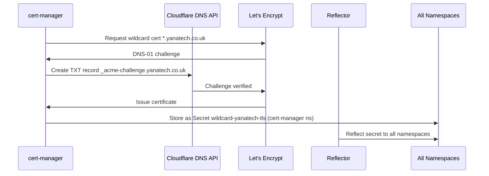

- **ClusterIssuer:** `letsencrypt-prod` (Ready)
- **Secret name:** `wildcard-yanatech-tls` (reflected to every namespace by Reflector)
- **Challenge:** Cloudflare DNS-01 (no port 80 exposure required)

### 4.5 Traffic Flow — Web Request

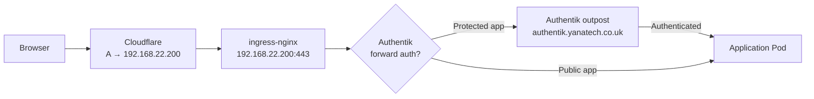

### 4.6 Traffic Flow — API Request (yana-stocks)

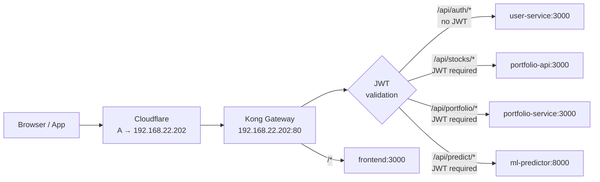

### 4.7 SSO — Authentik Forward Auth

For apps without native OIDC, Authentik forward auth is used:

1. App's Ingress has `nginx.ingress.kubernetes.io/auth-url` pointing to the app's outpost endpoint
2. Each protected app gets an `ak-outpost-<name>` pod deployed automatically in the `authentik` namespace
3. An ExternalName Service in the app's namespace routes `/outpost.goauthentik.io` to the outpost
4. A second Ingress in the app namespace routes the outpost path

**Important:** `auth-url` must use the **external** hostname (not internal service IP) — outposts match by external host.

### 4.8 Network Policies

Every namespace has `default-deny-all`. Key policy files:

| File                                                           | Coverage                                                    |
| -------------------------------------------------------------- | ----------------------------------------------------------- |
| `infrastructure/network-policies/netpol-infrastructure.yaml`   | All infrastructure namespaces                               |
| `infrastructure/network-policies/netpol-cnpg.yaml`             | CNPG operator + clusters                                    |
| `infrastructure/network-policies/netpol-monitoring.yaml`       | Monitoring stack                                            |
| `infrastructure/network-policies/netpol-apiserver-egress.yaml` | kube-apiserver egress for operator namespaces               |
| `infrastructure/cilium/ciliumnetpol-ceph-osd.yaml`             | Ceph OSD egress (ports 6802-6809, `toCIDR` 192.168.22.0/24) |
| `infrastructure/cilium/ciliumnetpol-grafana-prometheus.yaml`   | Grafana → Prometheus (ClusterIP bypass)                     |

---

## 5. Storage

### 5.1 Ceph RBD

| Property      | Value                                  |
| ------------- | -------------------------------------- |
| Type          | Ceph RBD (block storage)               |
| StorageClass  | `ceph-rbd` (default)                   |
| Raw capacity  | 8.4 TiB                                |
| OSDs          | 6 (2 per Proxmox host)                 |
| Monitors      | 192.168.22.11-13:6789                  |
| Cluster ID    | `92197a62-7cf9-49eb-a0cb-5e0b9bbff52a` |
| Access mode   | RWO (ReadWriteOnce)                    |
| CSI namespace | `ceph-csi-rbd`                         |

All PersistentVolumeClaims cluster-wide use `ceph-rbd`. There is no NFS or local-path storage.

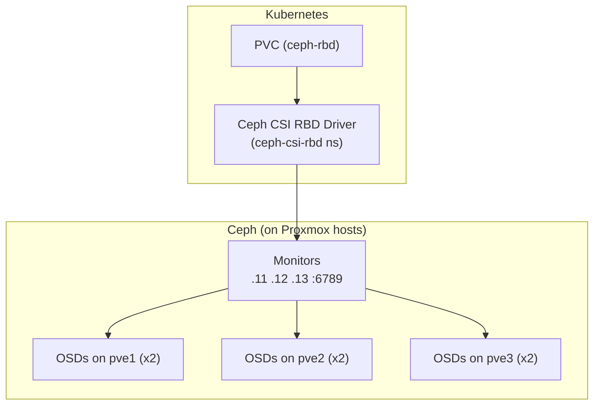

**Critical:** Ceph CSI egress to OSD ports 6802-6809 **must** use `CiliumNetworkPolicy` with `toCIDR: 192.168.22.0/24` — standard `NetworkPolicy` cannot reach bare-metal IPs in Cilium native routing mode.

### 5.2 PVC Inventory

| Namespace       | PVC                                  | Size         | Consumer                    |
| --------------- | ------------------------------------ | ------------ | --------------------------- |
| `cnpg-clusters` | pg-main-1/2/4                        | 50 Gi × 3    | Shared PostgreSQL (pg-main) |
| `harbor`        | harbor-registry                      | 100 Gi       | Image layers                |
| `harbor`        | harbor-database                      | 10 Gi        | Harbor PostgreSQL           |
| `harbor`        | harbor-redis / trivy                 | 5 Gi / 10 Gi | Harbor cache/scanner        |
| `immich`        | immich-library                       | 200 Gi       | Photo library               |
| `immich`        | immich-postgres-1                    | 20 Gi        | Immich CNPG PostgreSQL      |
| `kafka`         | data-kafka-cluster-dual-role-{0,1,2} | 20 Gi × 3    | Kafka log data              |
| `minio`         | minio                                | 50 Gi        | Object storage              |
| `mongodb`       | datadir-mongodb-{0,1}                | 10 Gi × 2    | MongoDB replicas            |
| `monitoring`    | prometheus-db                        | 20 Gi × 2    | Prometheus TSDB             |
| `monitoring`    | alertmanager-db                      | 5 Gi × 2     | Alertmanager state          |
| `monitoring`    | storage-loki-0                       | 20 Gi        | Loki log storage            |
| `monitoring`    | storage-tempo-0                      | 20 Gi        | Tempo trace storage         |
| `nextcloud`     | nextcloud-nextcloud                  | 100 Gi       | Nextcloud data              |
| `redis`         | redis-data-redis-master-0            | 5 Gi         | Redis AOF/RDB               |
| `yana-stocks`   | user-service-pg-1                    | 10 Gi        | yana-stocks PostgreSQL      |
| `vaultwarden`   | vaultwarden-data                     | 5 Gi         | Vault data                  |
| `uptime-kuma`   | uptime-kuma-pvc                      | 5 Gi         | Kuma database               |

---

## 6. Secret Management

### 6.1 Architecture

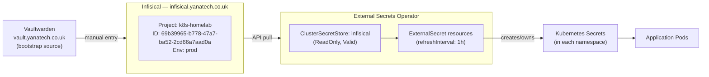

**ESO webhook is disabled** (`webhook.create: false`, `certController.create: false`) — Cilium native routing blocks kube-apiserver node IP connections to in-cluster webhook services.

### 6.2 ExternalSecret Pattern

```yaml
apiVersion: external-secrets.io/v1
kind: ExternalSecret
metadata:
  name: my-secret
  namespace: my-namespace
spec:
  refreshInterval: 1h
  secretStoreRef:
    name: infisical
    kind: ClusterSecretStore
  target:
    name: my-secret
    creationPolicy: Owner
  data:
    - secretKey: my-key
      remoteRef:
        key: /my-folder/MY_SECRET_NAME
```

### 6.3 Secret Path Convention

Secrets in Infisical follow the path pattern `/namespace/SECRET_NAME`.

### 6.4 Bootstrap Process

For a fresh cluster, Vaultwarden (at `vault.yanatech.co.uk`) is the source of truth for manually provisioning the initial Infisical credentials and any secrets that ESO cannot yet pull.

---

## 7. GitOps & CI/CD

### 7.1 ArgoCD

| Property           | Value                                   |
| ------------------ | --------------------------------------- |
| Version            | v3.4.2                                  |
| URL                | https://argocd.yanatech.co.uk           |
| Source repo        | https://github.com/akann/k8s-apps       |
| Sync policy        | Automated (prune: true, selfHeal: true) |
| Namespace creation | Via `CreateNamespace=true` syncOption   |
| Apply method       | `ServerSideApply=true`                  |

All applications use **app-of-apps pattern** or direct ArgoCD `Application` manifests. The sync wave annotation controls deployment ordering.

### 7.2 ArgoCD Sync Waves

| Wave | Components                                                                    |
| ---- | ----------------------------------------------------------------------------- |
| 0    | MetalLB, Ceph CSI                                                             |
| 1    | Cilium, cert-manager, ingress-nginx                                           |
| 2    | MetalLB IPAddressPool+L2Advertisement, cert-manager ClusterIssuers            |
| 3    | Reflector, Reloader, Kured, Descheduler, KEDA, Argo Rollouts, NetworkPolicies |
| 4    | Authentik, kube-prometheus-stack, Tempo, Velero                               |
| 5    | Loki+Promtail, Headlamp, Goldilocks, Redis, MongoDB, MinIO, Kong              |
| 6    | ESO, Infisical, Redis Insight, Mongo Express                                  |
| 7    | CNPG operator, CNPG clusters (pg-main, immich-postgres)                       |
| 8    | Harbor, Actions Runner Controller                                             |
| 9+   | Applications (Vaultwarden, Kafka, Immich, Nextcloud, etc.)                    |
| 10+  | yana-stocks services                                                          |

### 7.3 yana-stocks CI/CD Pipeline

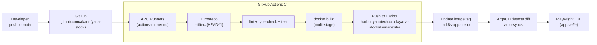

- **Turborepo** only builds services whose source changed (`--filter=[HEAD^1]`)
- **Harbor** stores images tagged with git SHA + `latest`
- **Runners** are self-hosted ARC runners in the `actions-runner` namespace
- **Secret:** `HARBOR_USERNAME`, `HARBOR_PASSWORD`, `GH_PAT` in GitHub Actions

### 7.4 Known Permanent OutOfSync (cosmetic, all Healthy)

These apps show OutOfSync in ArgoCD UI but are functioning correctly:

| App                         | Reason                                                  |
| --------------------------- | ------------------------------------------------------- |
| `actions-runner-controller` | OCI registry limitation                                 |
| `argo-rollouts`             | Cluster-scoped CRDs tracked twice                       |
| `infisical`                 | Bundled nginx chart mutation                            |
| `kafka`                     | Strimzi bootstrap Service patch timeout (upstream)      |
| `immich`                    | SharedResourceWarning (ingress shared between two apps) |

---

## 8. Platform Services

### 8.1 Databases

#### CloudNativePG (CNPG) — PostgreSQL

| Cluster           | Namespace       | Instances | Primary           | Size      | Consumers                                              |
| ----------------- | --------------- | --------- | ----------------- | --------- | ------------------------------------------------------ |
| `pg-main`         | `cnpg-clusters` | 3         | pg-main-1         | 50 Gi × 3 | vaultwarden, authentik, nextcloud, infisical, apicurio |
| `immich-postgres` | `immich`        | 1         | immich-postgres-1 | 20 Gi     | Immich (pgvector/VectorChord)                          |
| `user-service-pg` | `yana-stocks`   | 1         | user-service-pg-1 | 10 Gi     | yana-stocks user-service                               |

**pg-main connection:** `pg-main-rw.cnpg-clusters.svc.cluster.local:5432`  
**Immich:** uses `ghcr.io/tensorchord/cloudnative-vectorchord:16-1.1.1` (vector extension for AI search)

#### MongoDB

- **StatefulSet:** `mongodb` (2 replicas) + `mongodb-arbiter` (1)
- **ReplicaSet:** `rs0`
- **Connection:** `mongodb-headless.mongodb.svc.cluster.local:27017`
- **PVC:** 10 Gi per replica (ceph-rbd)
- **UI:** Mongo Express at `mongo.yanatech.co.uk` (Authentik-protected)

#### Redis

- **StatefulSet:** `redis-master` (standalone, 1 replica)
- **Connection:** `redis-master.redis.svc.cluster.local:6379`
- **PVC:** 5 Gi (ceph-rbd)
- **UI:** Redis Insight at `redis.yanatech.co.uk` (Authentik-protected)

#### MinIO

- **Connection:** `minio.minio.svc.cluster.local:9000`
- **PVC:** 50 Gi (ceph-rbd)
- **Console:** `minio-console.yanatech.co.uk`
- **API endpoint:** `minio.yanatech.co.uk`

### 8.2 Message Broker — Kafka (Strimzi)

| Property       | Value                                                        |
| -------------- | ------------------------------------------------------------ |
| Operator       | Strimzi `strimzi-cluster-operator`                           |
| Cluster name   | `kafka-cluster`                                              |
| Mode           | KRaft (combined broker + controller, no ZooKeeper)           |
| Brokers        | 3 dual-role pods (`kafka-cluster-dual-role-{0,1,2}`)         |
| Bootstrap      | `kafka-cluster-kafka-bootstrap.kafka.svc.cluster.local:9092` |
| PVC per broker | 20 Gi (ceph-rbd)                                             |
| UI             | `kafka-ui.yanatech.co.uk` (Authentik-protected)              |

**Topics:**

| Topic                       | Partitions | Replication | Retention | Producer           | Consumer(s)                 |
| --------------------------- | ---------- | ----------- | --------- | ------------------ | --------------------------- |
| `stocks.prices.raw`         | 3          | 3           | 24h       | price-ingestor     | price-processor             |
| `stocks.prices.processed`   | 3          | 3           | 7d        | price-processor    | ml-predictor, portfolio-api |
| `stocks.signals.sentiment`  | 3          | 3           | 7d        | sentiment-analyzer | portfolio-api               |
| `stocks.signals.prediction` | 3          | 3           | 7d        | ml-predictor       | portfolio-api               |
| `stocks.portfolio.events`   | 3          | 3           | 30d       | portfolio-service  | price-processor             |

### 8.3 Container Registry — Harbor

- **URL:** `harbor.yanatech.co.uk`
- **Project:** `yana-stocks`
- **Image format:** `harbor.yanatech.co.uk/yana-stocks/<service>:<tag>`
- **Storage:** 100 Gi registry PVC + 10 Gi database PVC (ceph-rbd)
- **Vulnerability scanning:** Trivy (10 Gi PVC)

### 8.4 Cluster Maintenance

| Tool            | Purpose                                                                           | Namespace                 |
| --------------- | --------------------------------------------------------------------------------- | ------------------------- |
| **Kured**       | Auto-reboot nodes when `/var/run/reboot-required` is set (after kernel updates)   | `kured`                   |
| **Descheduler** | Evict and reschedule pods to rebalance cluster                                    | `kube-system` (daemonset) |
| **Goldilocks**  | VPA-based resource request recommendations                                        | `goldilocks`              |
| **Reloader**    | Rolling restart pods when ConfigMaps/Secrets change                               | `reloader`                |
| **Reflector**   | Mirror `wildcard-yanatech-tls` Secret + any annotated resources across namespaces | `reflector`               |

---

## 9. Applications

### 9.1 Service URLs

| Service       | URL                                  | Auth              | Notes                    |
| ------------- | ------------------------------------ | ----------------- | ------------------------ |
| ArgoCD        | https://argocd.yanatech.co.uk        | Native            | GitOps UI                |
| Authentik     | https://authentik.yanatech.co.uk          | Native            | SSO IdP                  |
| Grafana       | https://grafana.yanatech.co.uk       | Authentik OIDC    | Metrics dashboards       |
| Immich        | https://photos.yanatech.co.uk        | Native            | Photo management         |
| Infisical     | https://infisical.yanatech.co.uk     | Native            | Secrets manager          |
| Harbor        | https://harbor.yanatech.co.uk        | Native            | Container registry       |
| Nextcloud     | https://cloud.yanatech.co.uk         | Native            | Cloud storage            |
| Kong API GW   | https://api-gateway.yanatech.co.uk   | JWT (per-route)   | yana-stocks API          |
| MinIO Console | https://minio-console.yanatech.co.uk | Native            | Object storage UI        |
| MongoDB UI    | https://mongo.yanatech.co.uk         | Authentik forward | Mongo Express            |
| Redis UI      | https://redis.yanatech.co.uk         | Authentik forward | Redis Insight            |
| Headlamp      | https://headlamp.yanatech.co.uk      | SA token          | Kubernetes UI            |
| Kafka UI      | https://kafka-ui.yanatech.co.uk      | Authentik forward | Kafka browser            |
| Argo Rollouts | https://rollouts.yanatech.co.uk      | Authentik forward | Canary dashboard         |
| pgAdmin       | https://pgadmin.yanatech.co.uk       | Native            | PostgreSQL UI            |
| Apicurio      | https://apicurio.yanatech.co.uk      | Authentik forward | Schema registry          |
| Vaultwarden   | https://vault.yanatech.co.uk         | Native            | Password manager         |
| Uptime Kuma   | https://status.yanatech.co.uk        | Authentik forward | Uptime monitoring        |
| Hubble UI     | https://hubble.yanatech.co.uk        | Authentik forward | Cilium network viz       |
| Goldilocks    | https://goldilocks.yanatech.co.uk    | Authentik forward | Resource recommendations |
| Gotify        | https://gotify.yanatech.co.uk        | Native            | Push notifications       |
| yana-stocks   | https://stocks.yanatech.co.uk        | JWT (in-app)      | Stock market app         |
| yanatech      | https://yanatech.co.uk               | Public            | Landing page             |

**Note on Headlamp:** Authentik SSO is broken upstream; use a long-lived ServiceAccount token:

```bash
kubectl create token headlamp -n headlamp --duration=8760h
```

---

## 10. yana-stocks Architecture

A production-grade, event-driven microservices application for real-time stock data, portfolio management, sentiment analysis, and ML price prediction.

**Source:** `github.com/akann/yana-stocks` (Turborepo monorepo)  
**Namespace:** `yana-stocks`

### 10.1 Service Overview

| Service              | Language                | Pattern                | Replicas | Dependencies                                                          |
| -------------------- | ----------------------- | ---------------------- | -------- | --------------------------------------------------------------------- |
| `frontend`           | Next.js 14 (App Router) | Deployment             | 2        | portfolio-api                                                         |
| `portfolio-api`      | NestJS                  | Deployment             | 2        | user-service, portfolio-service, price-processor, ml-predictor, Redis |
| `portfolio-service`  | NestJS                  | Deployment             | 2        | MongoDB, Kafka                                                        |
| `price-processor`    | NestJS                  | Deployment             | 2        | MongoDB, Redis, Kafka                                                 |
| `user-service`       | NestJS                  | Deployment             | 2        | CNPG PostgreSQL, Redis, Kafka                                         |
| `price-ingestor`     | Python                  | Deployment + KEDA      | 0–3      | Alpaca API, Kafka                                                     |
| `sentiment-analyzer` | Python                  | Deployment + KEDA      | 0–3      | NewsAPI, MongoDB, Kafka                                               |
| `ml-predictor`       | Python                  | Argo Rollouts (canary) | 1        | MongoDB, MinIO, Kafka                                                 |

### 10.2 Data Flow

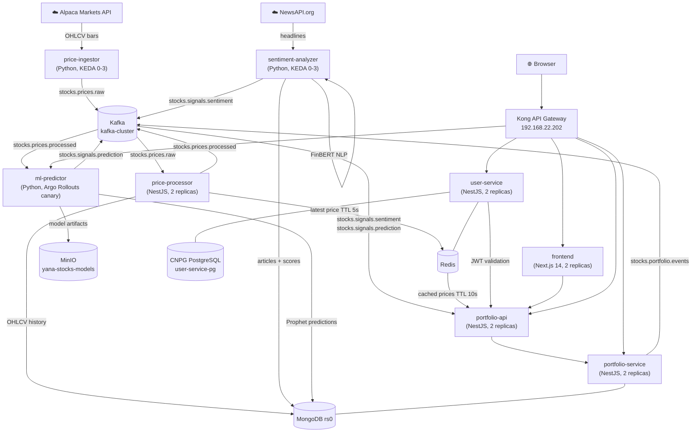

### 10.3 Authentication Flow

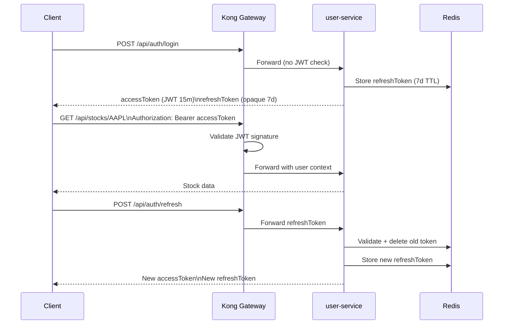

### 10.4 Kong API Routes

| Route              | Method | Target                   | JWT Required |
| ------------------ | ------ | ------------------------ | ------------ |
| `/api/auth/*`      | ALL    | `user-service:3000`      | No           |
| `/api/stocks/*`    | GET    | `portfolio-api:3000`     | Yes          |
| `/api/portfolio/*` | ALL    | `portfolio-service:3000` | Yes          |
| `/api/predict/*`   | GET    | `ml-predictor:8000`      | Yes          |
| `/api/market/*`    | GET    | `portfolio-api:3000`     | Yes          |
| `/api/signals/*`   | GET    | `portfolio-api:3000`     | Yes          |
| `/api/news/*`      | GET    | `portfolio-api:3000`     | Yes          |
| `/api/health`      | GET    | `portfolio-api:3000`     | No           |
| `/*`               | ALL    | `frontend:3000`          | No           |

### 10.5 KEDA Autoscaling

Both `price-ingestor` and `sentiment-analyzer` scale to zero when their Kafka consumer group has no lag:

```yaml
# ScaledObject pattern (both services)
triggers:
  - type: kafka
    metadata:
      bootstrapServers: kafka-cluster-kafka-bootstrap.kafka.svc.cluster.local:9092
      consumerGroup: <service-name>
      topic: <input-topic>
      lagThreshold: "10"
minReplicaCount: 0
maxReplicaCount: 3
```

### 10.6 Argo Rollouts — ml-predictor Canary

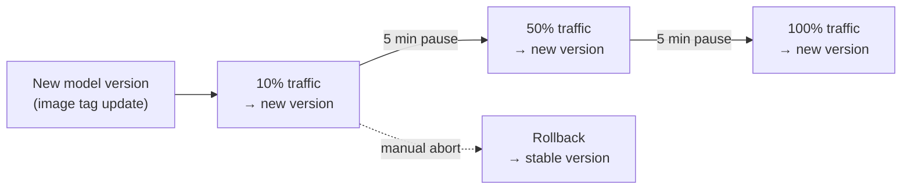

Dashboard: `rollouts.yanatech.co.uk` (Authentik-protected)

### 10.7 Kafka Topic Flow

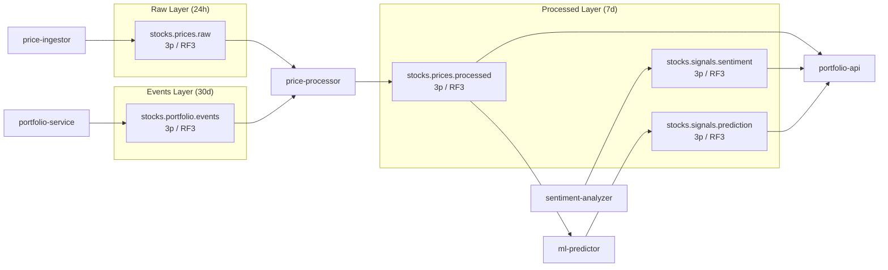

### 10.8 Monorepo Structure

```
yana-stocks/                    # github.com/akann/yana-stocks
├── apps/
│   ├── frontend/               # Next.js 14 (App Router), TailwindCSS, Recharts
│   ├── price-processor/        # NestJS, Mongoose, ioredis, KafkaJS
│   ├── user-service/           # NestJS, Prisma, JWT, KafkaJS
│   ├── portfolio-service/      # NestJS, Mongoose, KafkaJS
│   ├── portfolio-api/          # NestJS, aggregator + auth proxy
│   └── e2e/                    # Playwright (Chromium + iPhone 14)
├── services/
│   ├── price-ingestor/         # Python 3.12, confluent-kafka, alpaca-py, uv
│   ├── sentiment-analyzer/     # Python 3.12, HuggingFace FinBERT, NewsAPI, uv
│   └── ml-predictor/           # Python 3.12, FastAPI, Prophet, scikit-learn, uv
└── packages/
    ├── shared-types/           # TypeScript interfaces (Stock, OHLCV, Portfolio, …)
    ├── shared-dto/             # Validation DTOs (class-validator)
    ├── kafka-client/           # KAFKA_TOPICS constants + config factory
    ├── typescript-config/      # Shared tsconfig bases (base, nestjs, nextjs)
    ├── eslint-config/          # Shared ESLint
    └── prettier-config/        # Shared Prettier
```

---

## 11. Observability

### 11.1 Stack

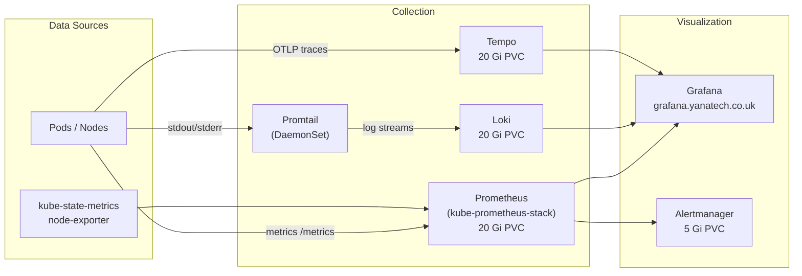

**Note:** Grafana → Prometheus requires `CiliumNetworkPolicy` — `ClusterIP` routing for Prometheus fails with Cilium native routing, causing `context deadline exceeded` errors. See `infrastructure/cilium/ciliumnetpol-grafana-prometheus.yaml`.

### 11.2 Network Observability

- **Hubble UI:** `hubble.yanatech.co.uk` — real-time L3/L4 flow visualization built into Cilium
- **Authentik-protected** via forward auth

---

## 12. Deployment Patterns

### 12.1 Standard Deployment (most services)

```yaml
apiVersion: argoproj.io/v1alpha1
kind: Application
metadata:
  name: my-app
  namespace: argocd
  annotations:
    argocd.argoproj.io/sync-wave: "9"
spec:
  project: default
  source:
    repoURL: https://github.com/akann/k8s-apps
    path: apps/my-app
    targetRevision: HEAD
  destination:
    server: https://kubernetes.default.svc
    namespace: my-namespace
  syncPolicy:
    automated:
      prune: true
      selfHeal: true
    syncOptions:
      - CreateNamespace=true
      - ServerSideApply=true
```

Use `valuesObject:` (not `values: |`) for Helm values to avoid YAML indentation issues.

### 12.2 Helm Chart Deployment

For charts hosted on OCI or HTTP registries:

```yaml
spec:
  source:
    chart: <chart-name>
    repoURL: https://charts.example.com
    targetRevision: 1.2.3
    helm:
      valuesObject:
        key: value
```

### 12.3 Authentik Forward Auth Pattern

For apps without native OIDC (Kafka UI, Redis Insight, etc.):

```yaml
# Main app Ingress
annotations:
  nginx.ingress.kubernetes.io/auth-url: "https://<hostname>/outpost.goauthentik.io/auth/nginx"
  nginx.ingress.kubernetes.io/auth-signin: "https://<hostname>/outpost.goauthentik.io/start?rd=$escaped_request_uri"
  nginx.ingress.kubernetes.io/auth-response-headers: "Set-Cookie,X-authentik-username,X-authentik-groups,X-authentik-email,X-authentik-name,X-authentik-uid"
  nginx.ingress.kubernetes.io/auth-snippet: |
    proxy_set_header X-Original-URL $scheme://$http_host$request_uri;
```

Requires `allowSnippetAnnotations: true` and `annotations-risk-level: Critical` on ingress-nginx.

### 12.4 Adding a New Namespace Checklist

1. Add `default-deny-all` NetworkPolicy to appropriate netpol file
2. Add specific ingress/egress policies
3. Add `allow-kube-apiserver-egress` to `netpol-apiserver-egress.yaml` if namespace has operators/controllers
4. If the app needs TLS: the `wildcard-yanatech-tls` secret will be auto-reflected by Reflector (no action needed if annotation is on the namespace)
5. If secrets needed: create `ExternalSecret` resources pointing to the `infisical` ClusterSecretStore
6. If Authentik SSO needed: create Authentik Provider + Application + outpost; add auth annotations to Ingress

---

## 13. Backup & Recovery

### 13.1 Velero

| Property      | Value                        |
| ------------- | ---------------------------- |
| Schedule      | Weekly, Sundays at 02:00 UTC |
| Schedule name | `velero-weekly-backup`       |
| Namespace     | `velero`                     |

Velero backs up Kubernetes resources and PVC snapshots. Configure a `BackupStorageLocation` pointing to MinIO (`minio.minio.svc.cluster.local:9000`) for object storage of backups.

### 13.2 CNPG Backup

CloudNativePG clusters support WAL archiving to S3-compatible storage. Configure backup targets per-cluster to stream WAL to MinIO.

### 13.3 Recovery Priorities

| Priority | Data                              | RTO                            |
| -------- | --------------------------------- | ------------------------------ |
| Critical | Vaultwarden (password vault)      | Restore from Velero backup     |
| High     | Infisical secrets, CNPG data      | Restore from WAL / Velero      |
| High     | Immich photo library (200 Gi PVC) | Restore PVC from Ceph snapshot |
| Medium   | Nextcloud files, MongoDB          | Restore from Velero            |
| Low      | Redis, monitoring TSDB            | Ephemeral acceptable, re-seed  |

---

## Appendix: Known Operational Notes

### Infisical Webhook (CRITICAL)

The infisical bundled nginx creates `infisical-ingress-nginx-admission` ValidatingWebhookConfiguration which blocks ALL ingress and ExternalSecret creation cluster-wide when it times out.

**Permanent fix applied:** infisical nginx scaled to 0, `admissionWebhooks.enabled: false`, `failurePolicy: Ignore` patched.

**If it reappears:**

```bash
kubectl delete validatingwebhookconfiguration infisical-ingress-nginx-admission 2>/dev/null; true
kubectl delete service infisical-ingress-nginx-controller-admission -n infisical 2>/dev/null; true
```

### ESO Webhook Disabled

ESO `webhook` and `certController` are both disabled. Do not re-enable without adding a `CiliumNetworkPolicy` allowing kube-apiserver node IP → ESO webhook service.

### Ceph OSD Egress

Standard `NetworkPolicy` cannot reach Ceph OSDs on ports 6802-6809 (bare-metal IPs) in Cilium native routing mode. Use `CiliumNetworkPolicy` with `toCIDR: 192.168.22.0/24` for any namespace mounting Ceph RBD volumes.

### Infisical Ingress Class Reversion

After ArgoCD sync, infisical ingress may revert to `infisical-nginx` class. Manual patch:

```bash
kubectl patch ingress infisical-ingress -n infisical --type='json' \
  -p='[{"op":"replace","path":"/spec/ingressClassName","value":"nginx"},...]'
```
