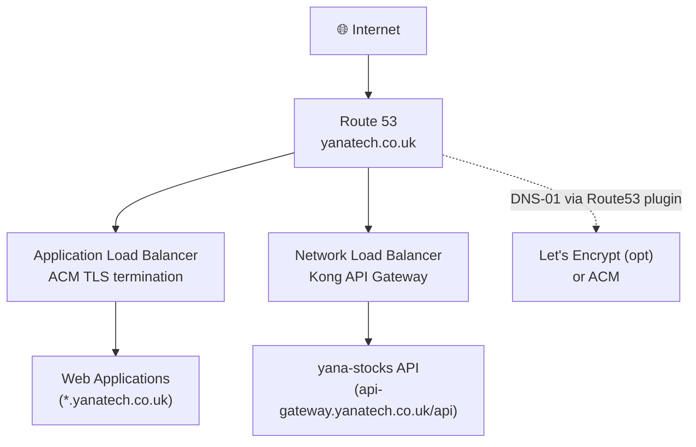
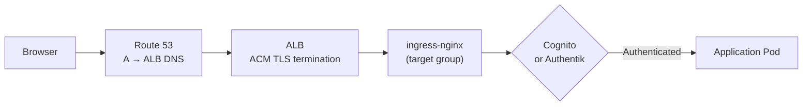
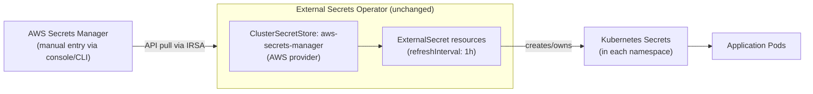
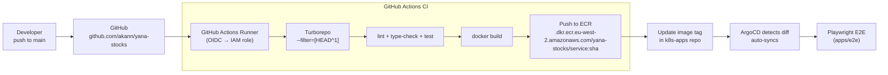

# Architecture — yanatech.co.uk on AWS

> **Reference:** AWS translation of [README.md](README.md)  
> **yana-stocks app:** [stocks.yanatech.co.uk](https://stocks.yanatech.co.uk) · [github.com/akann/yana-stocks](https://github.com/akann/yana-stocks)

This document maps the homelab architecture to AWS equivalents component by component. Tools that remain the same on AWS are noted explicitly; everything else is replaced by a managed AWS service.

---

## Component Translation Map

| Homelab | AWS Equivalent | Notes |
|---------|---------------|-------|
| Proxmox hypervisors | EC2 (managed by EKS) | Abstracted away — EKS provisions nodes |
| Ceph RBD | Amazon EBS (gp3) | Block storage, same RWO semantics |
| Ceph monitors | EBS — no equivalent needed | Block storage is managed |
| TP-Link switch / VLANs | VPC + Subnets + Security Groups | L3 construct replaces L2 VLANs |
| kubeadm (3 CP + 3 workers) | Amazon EKS | Managed control plane, no etcd to operate |
| Cilium CNI | AWS VPC CNI (default) | Cilium also runs on EKS — see §4.1 |
| MetalLB | AWS Load Balancer Controller (NLB) | Provisions NLB via Service annotations |
| ingress-nginx | ingress-nginx on NLB **or** AWS ALB Ingress Controller | ingress-nginx carries over unchanged |
| Cloudflare DNS | Amazon Route 53 | Hosted zone for yanatech.co.uk |
| cert-manager + Let's Encrypt | AWS Certificate Manager (ACM) | Or keep cert-manager with Route53 DNS-01 solver |
| Authentik SSO | Amazon Cognito **or** keep Authentik on EKS | Cognito = less ops; Authentik = same UX |
| Reflector (TLS mirror) | Not needed — ACM certs attach to load balancer | TLS termination moves to ALB/NLB |
| Infisical | AWS Secrets Manager | ESO stays, provider changes |
| External Secrets Operator | ESO with AWS Secrets Manager provider | Same operator, IRSA for auth |
| Vaultwarden (bootstrap) | AWS Secrets Manager (manual entry) | Or keep Vaultwarden on EKS |
| CNPG PostgreSQL | Amazon Aurora PostgreSQL Serverless v2 | Or RDS PostgreSQL Multi-AZ |
| MongoDB | Amazon DocumentDB (MongoDB-compatible) | Or MongoDB Atlas |
| Redis | Amazon ElastiCache for Redis (cluster mode off) | Same connection string pattern |
| MinIO | Amazon S3 | Native S3 — no translation cost |
| Strimzi Kafka | Amazon MSK (Managed Streaming for Kafka) | Same Kafka protocol |
| Harbor | Amazon ECR | Private registry, IAM auth |
| Self-hosted ARC runners | GitHub Actions with IRSA **or** AWS CodeBuild | IRSA lets runners assume IAM roles |
| Prometheus | Amazon Managed Prometheus (AMP) | Remote-write from in-cluster agent |
| Grafana | Amazon Managed Grafana (AMG) | Or keep self-hosted Grafana |
| Loki | Amazon CloudWatch Logs | Or keep Loki on EKS |
| Tempo | AWS X-Ray | Or keep Tempo on EKS |
| Velero | Velero + S3 + EBS snapshots | Same tool, AWS storage backend |
| Kured | EKS managed node group auto-updates | Or Bottlerocket OS update orchestrator |
| Descheduler | Karpenter | Bin-packing + auto-scaling |
| Goldilocks / VPA | AWS Compute Optimizer + Karpenter | Right-sizing recommendations |
| Reloader | Reloader (unchanged on EKS) | Same Helm chart |
| ArgoCD | ArgoCD on EKS (unchanged) | Same Helm chart, same workflow |
| Kong API Gateway | Kong on EKS (unchanged) **or** Amazon API Gateway | Kong carries over; API GW for serverless |
| KEDA | KEDA on EKS (unchanged) | Same, use SQS/MSK scalers instead of Kafka |
| Argo Rollouts | Argo Rollouts on EKS (unchanged) | Same canary patterns |

---

## Table of Contents

1. [Overview](#1-overview)
2. [AWS Infrastructure](#2-aws-infrastructure)
3. [Kubernetes Cluster — EKS](#3-kubernetes-cluster--eks)
4. [Networking](#4-networking)
5. [Storage](#5-storage)
6. [Secret Management](#6-secret-management)
7. [GitOps & CI/CD](#7-gitops--cicd)
8. [Platform Services](#8-platform-services)
9. [Applications](#9-applications)
10. [yana-stocks Architecture](#10-yana-stocks-architecture)
11. [Observability](#11-observability)
12. [Deployment Patterns](#12-deployment-patterns)
13. [Backup & Recovery](#13-backup--recovery)

---

## 1. Overview

The same GitOps-first architecture running on AWS managed services. EKS replaces the self-managed kubeadm cluster; AWS managed services replace self-hosted stateful workloads; ArgoCD and application-layer tools are unchanged.

**Design principles (unchanged):**

- GitOps-first: git is the single source of truth
- Zero-trust networking: every namespace has `default-deny-all` NetworkPolicy
- Secrets never in git: ESO pulls from AWS Secrets Manager via IRSA
- TLS terminated at the load balancer via ACM (no Reflector needed)
- SSO on all web UIs via Cognito or Authentik



---

## 2. AWS Infrastructure

### 2.1 VPC Layout

Replace the three-host Proxmox cluster and physical VLANs with a VPC spanning three Availability Zones.

| Component | Homelab equivalent | Detail |
|-----------|-------------------|--------|
| VPC | 192.168.0.0/16 network | e.g. `10.0.0.0/16` |
| Public subnets (× 3 AZs) | 192.168.33.200–202 VIPs | Load balancer front-ends |
| Private subnets (× 3 AZs) | 192.168.33.31–33 node IPs | EKS nodes, RDS, ElastiCache |
| NAT Gateway | Home router outbound | Per-AZ or shared single NAT |
| Internet Gateway | Home router inbound | For ALB/NLB public endpoints |

**Tagging requirements for EKS:**

```
Public subnets:   kubernetes.io/role/elb = 1
Private subnets:  kubernetes.io/role/internal-elb = 1
All subnets:      kubernetes.io/cluster/<cluster-name> = shared
```

### 2.2 IAM Strategy — IRSA

All pod-level AWS API access uses **IAM Roles for Service Accounts (IRSA)** — no long-lived credentials, no secret rotation required. Every component that calls an AWS API (ESO, Velero, AMP remote-write, ARC runners) gets a dedicated IAM role bound to its Kubernetes ServiceAccount via an OIDC identity provider attached to the EKS cluster.

```
EKS OIDC provider → ServiceAccount annotation → IAM Role trust policy
```

Key IRSA roles to create:

| Component | IAM permissions needed |
|-----------|----------------------|
| ESO | `secretsmanager:GetSecretValue`, `ssm:GetParameter` |
| Velero | `s3:*` on backup bucket, `ec2:*` for EBS snapshots |
| AMP remote-write agent | `aps:RemoteWrite` |
| ECR image pulls | `ecr:GetAuthorizationToken`, `ecr:BatchGetImage` |
| ARC runners | `sts:AssumeRole` for deployment roles |
| Cluster Autoscaler / Karpenter | `ec2:*`, `iam:PassRole` |

---

## 3. Kubernetes Cluster — EKS

### 3.1 Control Plane

**Replace:** 3× kubeadm control-plane nodes + self-managed etcd

**AWS equivalent:** Amazon EKS managed control plane

- etcd, kube-apiserver, kube-controller-manager, kube-scheduler all managed by AWS
- Control plane runs in AWS-owned account; you only manage the data plane
- Multi-AZ by default — EKS spans the AZs you specify
- Upgrades: `eksctl upgrade cluster` or via console; AWS handles control plane

```bash
eksctl create cluster \
  --name yanatech \
  --region eu-west-2 \
  --version 1.32 \
  --zones eu-west-2a,eu-west-2b,eu-west-2c \
  --with-oidc
```

### 3.2 Data Plane — Managed Node Groups

**Replace:** 3× k8s-worker VMs (manual Ubuntu + containerd setup)

**AWS equivalent:** EKS managed node groups (or Karpenter for auto-provisioning)

```hcl
# Terraform example
resource "aws_eks_node_group" "workers" {
  cluster_name    = aws_eks_cluster.yanatech.name
  node_group_name = "workers"
  node_role_arn   = aws_iam_role.node.arn
  subnet_ids      = aws_subnet.private[*].id

  instance_types = ["m6i.xlarge"]   # ~equiv to i5-12600H VM with 8 vCPU / 16 GB

  scaling_config {
    desired_size = 3
    min_size     = 3
    max_size     = 6
  }

  update_config {
    max_unavailable = 1   # replaces kured — AWS drains + replaces nodes on update
  }
}
```

**Node updates:** EKS managed node groups handle OS and kubelet updates automatically — nodes are cordoned, drained, and replaced. Kured is not needed.

**Karpenter (optional — replaces Descheduler + Goldilocks):**

```yaml
# NodePool example
apiVersion: karpenter.sh/v1
kind: NodePool
spec:
  template:
    spec:
      requirements:
        - key: karpenter.sh/capacity-type
          values: ["on-demand"]
        - key: node.kubernetes.io/instance-type
          values: ["m6i.xlarge", "m6i.2xlarge"]
  disruption:
    consolidationPolicy: WhenUnderutilized
```

### 3.3 Namespaces

Unchanged. The same namespace layout applies on EKS. Replace or remove:

| Homelab namespace | AWS disposition |
|-------------------|----------------|
| `ceph-csi-rbd` | Remove — EBS CSI driver (`aws-ebs-csi-driver`) is an EKS add-on |
| `kured` | Remove — managed node group handles OS updates |
| `minio` | Remove — replaced by S3 |
| `harbor` | Remove — replaced by ECR |
| All others | Carry over unchanged |

---

## 4. Networking

### 4.1 CNI

**Default (recommended):** AWS VPC CNI (`amazon-vpc-cni-k8s`)

- Pods get VPC-native IPs (routable within the VPC without encapsulation)
- Security Groups for Pods available — assign SGs directly to pods (replaces some CiliumNetworkPolicy use cases)
- Installed as an EKS add-on

**Cilium on EKS (alternative):** Cilium runs on EKS with AWS VPC CNI in chained mode or in ENI mode. Choose this if you want to carry the homelab NetworkPolicy/CiliumNetworkPolicy config forward unchanged. See [Cilium EKS guide](https://docs.cilium.io/en/stable/installation/k8s-install-helm/).

**Cross-namespace ClusterIP routing caveat (homelab):** In the homelab, standard NetworkPolicy doesn't reliably handle cross-namespace ClusterIP traffic in Cilium native routing mode — requiring CiliumNetworkPolicy workarounds for Grafana → Prometheus and Grafana → PostgreSQL. With AWS VPC CNI this issue does not exist; standard NetworkPolicy works.

### 4.2 Load Balancing

**Replace:** MetalLB (bare-metal VIPs)

**AWS equivalent:** AWS Load Balancer Controller

```bash
helm install aws-load-balancer-controller eks/aws-load-balancer-controller \
  -n kube-system \
  --set clusterName=yanatech \
  --set serviceAccount.annotations."eks\.amazonaws\.com/role-arn"=<IRSA_ARN>
```

| Homelab | AWS |
|---------|-----|
| MetalLB VIP 192.168.33.200 (ingress-nginx) | NLB provisioned by `Service type: LoadBalancer` annotation |
| MetalLB VIP 192.168.33.202 (Kong) | NLB provisioned by `Service type: LoadBalancer` annotation |

**ingress-nginx on NLB:**

```yaml
# ingress-nginx service annotation
service.beta.kubernetes.io/aws-load-balancer-type: "external"
service.beta.kubernetes.io/aws-load-balancer-nlb-target-type: "ip"
service.beta.kubernetes.io/aws-load-balancer-scheme: "internet-facing"
```

**ALB Ingress alternative:** Replace ingress-nginx with the AWS ALB Ingress Controller for native ALB path-based routing. Trade-off: each Ingress object creates an ALB (cost); ingress-nginx consolidates all traffic to one NLB.

### 4.3 Ingress Controllers

| Class | Homelab controller | AWS equivalent |
|-------|--------------------|----------------|
| `nginx` | ingress-nginx (VIP .200) | ingress-nginx on NLB (unchanged Helm chart) |
| `kong` | Kong Ingress Controller (VIP .202) | Kong on NLB (unchanged) **or** Amazon API Gateway |

### 4.4 DNS

**Replace:** Cloudflare DNS

**AWS equivalent:** Amazon Route 53

- Create a public hosted zone for `yanatech.co.uk`
- Point the domain's NS records at Route 53
- Use `external-dns` to auto-create Route 53 records from Ingress/Service objects:

```yaml
# external-dns Helm values
provider: aws
aws:
  region: eu-west-2
domainFilters: ["yanatech.co.uk"]
serviceAccount:
  annotations:
    eks.amazonaws.com/role-arn: <IRSA_ARN>  # needs route53:ChangeResourceRecordSets
```

### 4.5 TLS

**Replace:** cert-manager + Let's Encrypt + Reflector

**Option A — ACM (recommended):**

AWS Certificate Manager issues and auto-renews certificates. TLS terminates at the ALB/NLB; no cert secret management in Kubernetes.

```
ACM → ALB listener (HTTPS:443) → HTTP to pods
```

```bash
# Request wildcard cert (DNS validation via Route53 — fully automated)
aws acm request-certificate \
  --domain-name "*.yanatech.co.uk" \
  --validation-method DNS \
  --subject-alternative-names "yanatech.co.uk"
```

```yaml
# ALB annotation to attach ACM cert
alb.ingress.kubernetes.io/certificate-arn: arn:aws:acm:eu-west-2:...:certificate/...
alb.ingress.kubernetes.io/ssl-policy: ELBSecurityPolicy-TLS13-1-2-2021-06
```

No Reflector needed — ACM manages cert lifecycle outside the cluster.

**Option B — keep cert-manager with Route53 DNS-01 solver:**

```yaml
# ClusterIssuer
solvers:
  - dns01:
      route53:
        region: eu-west-2
        hostedZoneID: Z...
        role: arn:aws:iam::...:role/cert-manager-route53  # IRSA
```

This preserves the existing cert-manager + Reflector workflow. Choose this if you need cert secrets available in-cluster (e.g. for non-ALB TCP/gRPC routes).

### 4.6 Traffic Flow — Web Request



### 4.7 SSO

**Replace:** Authentik

**Option A — Amazon Cognito:**

- User Pool for authentication (OIDC/OAuth2)
- ALB can natively integrate with Cognito — redirect unauthenticated requests to Cognito hosted UI without a sidecar or forward-auth proxy
- Lower operational overhead; less customisable than Authentik

```yaml
# ALB Ingress Cognito auth annotation
alb.ingress.kubernetes.io/auth-type: cognito
alb.ingress.kubernetes.io/auth-idp-cognito: '{"UserPoolArn":"arn:...","UserPoolClientId":"...","UserPoolDomain":"auth.yanatech"}'
alb.ingress.kubernetes.io/auth-on-unauthenticated-request: authenticate
```

**Option B — keep Authentik on EKS:**

Deploy Authentik unchanged via Helm. Connect it to a Cognito User Pool as an upstream OIDC provider if desired, or run it standalone. Forward-auth flow via ingress-nginx annotations is identical to the homelab.

### 4.8 Network Policies

Standard Kubernetes `NetworkPolicy` works correctly with AWS VPC CNI — no CiliumNetworkPolicy required. The cross-namespace ClusterIP workaround from the homelab (Grafana → Prometheus, Grafana → PostgreSQL) is not needed on AWS VPC CNI.

All existing `default-deny-all` NetworkPolicy objects carry over unchanged.

---

## 5. Storage

### 5.1 Block Storage — EBS

**Replace:** Ceph RBD

**AWS equivalent:** Amazon EBS (gp3) via the EBS CSI driver add-on

| Property | Homelab (Ceph RBD) | AWS (EBS gp3) |
|----------|--------------------|---------------|
| Access mode | RWO | RWO |
| StorageClass | `ceph-rbd` | `gp3` (EKS add-on default) |
| Provisioner | `rbd.csi.ceph.com` | `ebs.csi.aws.com` |
| Encryption | Ceph at-rest | EBS encryption with KMS |
| Snapshots | Ceph snapshots | EBS snapshots (VolumeSnapshot API) |
| Cross-AZ | Not applicable (single site) | PVCs are AZ-scoped — pods must schedule in same AZ |

```bash
# Install EBS CSI add-on (EKS managed)
aws eks create-addon \
  --cluster-name yanatech \
  --addon-name aws-ebs-csi-driver \
  --service-account-role-arn <IRSA_ARN>
```

```yaml
# StorageClass
apiVersion: storage.k8s.io/v1
kind: StorageClass
metadata:
  name: gp3
  annotations:
    storageclass.kubernetes.io/is-default-class: "true"
provisioner: ebs.csi.aws.com
parameters:
  type: gp3
  encrypted: "true"
volumeBindingMode: WaitForFirstConsumer   # critical for AZ alignment
reclaimPolicy: Retain
```

**Cross-AZ note:** EBS is single-AZ. Set `volumeBindingMode: WaitForFirstConsumer` so the PVC is provisioned in the same AZ as the pod. StatefulSets with anti-affinity (e.g. CNPG, MongoDB) need pod spread across AZs — each replica gets an EBS volume in its AZ.

### 5.2 Object Storage

**Replace:** MinIO

**AWS equivalent:** Amazon S3

All MinIO usage in the homelab maps directly to S3:

| Usage | S3 replacement |
|-------|---------------|
| Velero backup storage | S3 bucket with versioning |
| CNPG WAL archiving | S3 bucket (WAL-G/Barman Cloud) |
| ml-predictor model artifacts | S3 bucket |
| Grafana dashboards export | S3 bucket |

Access via IRSA — no access key/secret needed in pods.

### 5.3 PVC Inventory (EKS)

Replace Ceph RBD PVCs with EBS gp3. Remove MinIO PVC (use S3). Remove Harbor PVCs (use ECR).

| Namespace | PVC | Size | Consumer |
|-----------|-----|------|----------|
| `cnpg-clusters` | pg-main-1/4/5 | 50 Gi × 3 | Shared PostgreSQL (or replace with Aurora — see §8.1) |
| `immich` | immich-library | 200 Gi | Photo library |
| `immich` | immich-postgres-1 | 20 Gi | Immich CNPG PostgreSQL |
| `kafka` | data-kafka-cluster-dual-role-{0,1,2} | 20 Gi × 3 | Kafka (or replace with MSK — see §8.2) |
| `mongodb` | datadir-mongodb-{0,1} | 10 Gi × 2 | MongoDB (or replace with DocumentDB — see §8.1) |
| `monitoring` | prometheus-db | 20 Gi × 2 | Prometheus (or replace with AMP — see §11) |
| `nextcloud` | nextcloud-nextcloud | 100 Gi | Nextcloud data |
| `vaultwarden` | vaultwarden-data | 5 Gi | Vault data |
| `uptime-kuma` | uptime-kuma-pvc | 5 Gi | Uptime monitoring |
| `yana-stocks` | auth-service-pg-1 | 10 Gi | yana-stocks auth-service PostgreSQL |
| `k8s-docs` | k8s-docs-pg-1 | 10 Gi | k8s-docs RAG chatbot PostgreSQL (pgvector) |

---

## 6. Secret Management

### 6.1 Architecture

**Replace:** Infisical + ESO (Infisical provider) + Vaultwarden (bootstrap)

**AWS equivalent:** AWS Secrets Manager + ESO (AWS provider) + IRSA



ESO is unchanged — only the provider and ClusterSecretStore change.

### 6.2 ClusterSecretStore

```yaml
apiVersion: external-secrets.io/v1
kind: ClusterSecretStore
metadata:
  name: aws-secrets-manager
spec:
  provider:
    aws:
      service: SecretsManager
      region: eu-west-2
      auth:
        jwt:
          serviceAccountRef:
            name: external-secrets
            namespace: external-secrets
# No static credentials — IRSA on the ESO ServiceAccount
```

ESO ServiceAccount must be annotated with the IRSA role ARN:

```yaml
serviceAccount:
  annotations:
    eks.amazonaws.com/role-arn: arn:aws:iam::<ACCOUNT>:role/eso-secrets-manager
```

### 6.3 ExternalSecret Pattern

```yaml
# Identical to homelab — only secretStoreRef changes
apiVersion: external-secrets.io/v1
kind: ExternalSecret
metadata:
  name: my-secret
  namespace: my-namespace
spec:
  refreshInterval: 1h
  secretStoreRef:
    name: aws-secrets-manager   # was: infisical
    kind: ClusterSecretStore
  target:
    name: my-secret
    creationPolicy: Owner
  data:
    - secretKey: my-key
      remoteRef:
        key: /yanatech/my-namespace/MY_SECRET_NAME
```

### 6.4 Secret Path Convention

```
/yanatech/<namespace>/<SECRET_NAME>
```

Mirrors the Infisical path convention (`/namespace/SECRET_NAME`) — ExternalSecret `remoteRef.key` values only need a prefix change.

---

## 7. GitOps & CI/CD

### 7.1 ArgoCD

**Unchanged.** ArgoCD runs on EKS with the same Helm chart and same sync policy. No AWS-specific changes required.

| Property | Value |
|----------|-------|
| Version | v3.4.2 (unchanged) |
| Source repo | https://github.com/akann/k8s-apps |
| Sync policy | Automated (prune: true, selfHeal: true) |
| Apply method | ServerSideApply=true |

### 7.2 Container Registry

**Replace:** Harbor (`harbor.yanatech.co.uk`)

**AWS equivalent:** Amazon ECR

```bash
# Create ECR repository
aws ecr create-repository \
  --repository-name yana-stocks/auth-service \
  --image-scanning-configuration scanOnPush=true \
  --encryption-configuration encryptionType=AES256
```

**Image format:** `<ACCOUNT>.dkr.ecr.eu-west-2.amazonaws.com/yana-stocks/<service>:<tag>`

**Authentication:** EKS nodes assume the node IAM role which includes `ecr:GetAuthorizationToken` — no `imagePullSecret` needed. GitHub Actions workflows use OIDC federation with ECR:

```yaml
- uses: aws-actions/amazon-ecr-login@v2
  with:
    role-to-assume: arn:aws:iam::<ACCOUNT>:role/github-actions-ecr
```

### 7.3 CI/CD Pipeline

**Replace:** Self-hosted ARC runners in `actions-runner` namespace

**Option A — GitHub Actions with OIDC + IRSA (recommended):**

Keep GitHub-hosted or self-hosted runners; use AWS OIDC federation so runners can assume IAM roles without static credentials.

```yaml
# .github/workflows/deploy.yml
- uses: aws-actions/configure-aws-credentials@v4
  with:
    role-to-assume: arn:aws:iam::<ACCOUNT>:role/github-actions-deploy
    aws-region: eu-west-2
```

**Option B — keep ARC (Actions Runner Controller):** ARC on EKS is unchanged. Runners use IRSA to get ECR and EKS access. Removes the need for static `HARBOR_USERNAME`/`HARBOR_PASSWORD` secrets.



### 7.4 Known Permanent OutOfSync (cosmetic)

Same as homelab — these are ArgoCD/Helm chart behaviours unrelated to the underlying infrastructure:

| App | Reason |
|-----|--------|
| `actions-runner-controller` | OCI registry limitation |
| `argo-rollouts` | Cluster-scoped CRDs tracked twice |
| `kafka` | Strimzi bootstrap Service patch timeout (if using Strimzi instead of MSK) |
| `yana-stocks` (ml-predictor Rollout) | Cosmetic OutOfSync after SSA field-manager migration |

---

## 8. Platform Services

### 8.1 Databases

#### PostgreSQL

**Replace:** CloudNativePG `pg-main` cluster (self-managed, 3-instance)

**AWS equivalent:** Amazon Aurora PostgreSQL Serverless v2

| Property | Homelab (CNPG) | AWS (Aurora) |
|----------|---------------|--------------|
| Instances | 3 (primary + 2 standbys) | Writer + 1 reader (Aurora auto-manages replicas) |
| Failover | CNPG promotes standby | Aurora auto-promotes reader (<30 s) |
| WAL archiving | WAL to MinIO | Continuous backup to S3 (automated) |
| Scaling | Manual | Serverless v2 scales ACUs 0.5–64 |
| Connection string | `pg-main-rw.cnpg-clusters.svc:5432` | Aurora cluster endpoint (DNS) |
| Consumers | vaultwarden, authentik, nextcloud, infisical, apicurio | Same |

```bash
aws rds create-db-cluster \
  --db-cluster-identifier yanatech-pg \
  --engine aurora-postgresql \
  --engine-version 16.4 \
  --serverless-v2-scaling-configuration MinCapacity=0.5,MaxCapacity=8 \
  --db-subnet-group-name yanatech-private \
  --vpc-security-group-ids sg-...
```

**Immich PostgreSQL:** Immich requires `pgvector` / VectorChord. Aurora PostgreSQL supports `pgvector` natively as of Aurora 15.5+ — no custom image needed. Create a separate Aurora cluster for Immich or use an RDS PostgreSQL instance.

**k8s-docs PostgreSQL:** Same `pgvector` requirement as Immich (RAG chunk embeddings). Aurora's native `pgvector` support covers this too — use a separate Aurora cluster or RDS instance, kept dedicated and not shared with Immich's, matching the homelab's isolation.

**yana-stocks auth-service-pg:** Single-instance CNPG → RDS PostgreSQL (`db.t4g.micro`) or Aurora Serverless v2 (cheaper at low load with ACU min 0.5).

**Alternative — keep CNPG on EKS:** CNPG runs unchanged on EKS with EBS gp3 PVCs. Choose this if you want identical operational behaviour and WAL archiving to S3 via Barman Cloud.

#### MongoDB

**Replace:** MongoDB StatefulSet (2 replicas + arbiter, `rs0`)

**AWS equivalent:** Amazon DocumentDB (MongoDB 5.0-compatible)

| Property | Homelab | AWS |
|----------|---------|-----|
| Connection | `mongodb-headless.mongodb.svc:27017` | DocumentDB cluster endpoint |
| Replica set | Manual `rs0` | Managed, up to 15 replicas |
| Auth | Username/password | Username/password or IAM |

**Alternative — MongoDB Atlas:** If you need MongoDB 7+ features not available in DocumentDB, use Atlas with VPC peering to the EKS VPC.

#### Redis

**Replace:** Redis standalone StatefulSet

**AWS equivalent:** Amazon ElastiCache for Redis (cluster mode disabled)

| Property | Homelab | AWS |
|----------|---------|-----|
| Connection | `redis-master.redis.svc:6379` | ElastiCache primary endpoint |
| Persistence | AOF/RDB on EBS | Snapshot to S3 (automated) |
| Failover | Manual | Auto-failover with replica |

```bash
aws elasticache create-replication-group \
  --replication-group-id yanatech-redis \
  --replication-group-description "yanatech Redis" \
  --engine redis \
  --cache-node-type cache.t4g.micro \
  --num-cache-clusters 2 \
  --automatic-failover-enabled \
  --subnet-group-name yanatech-private
```

No code changes required — ElastiCache speaks the Redis protocol on port 6379.

### 8.2 Message Broker — Kafka

**Replace:** Strimzi Kafka (KRaft, 3 dual-role brokers)

**AWS equivalent:** Amazon MSK (Managed Streaming for Kafka)

| Property | Homelab (Strimzi) | AWS (MSK) |
|----------|-------------------|-----------|
| Brokers | 3 (KRaft, combined) | 3 brokers across 3 AZs |
| Bootstrap | `kafka-cluster-kafka-bootstrap.kafka.svc:9092` | MSK bootstrap endpoint |
| Protocol | Kafka (standard) | Kafka (standard) |
| Auth | PLAINTEXT (cluster-internal) | IAM or SCRAM-SHA-512 |
| Storage | 20 Gi EBS per broker | EBS provisioned per broker |
| Ops | Strimzi operator | AWS managed |

```bash
aws kafka create-cluster \
  --cluster-name yanatech-kafka \
  --broker-node-group-info \
    file://broker-config.json \
  --kafka-version "3.7.x" \
  --number-of-broker-nodes 3 \
  --enhanced-monitoring PER_TOPIC_PER_BROKER
```

**IAM auth for MSK (replaces PLAINTEXT):**

```properties
# Producer/consumer config
security.protocol=SASL_SSL
sasl.mechanism=AWS_MSK_IAM
sasl.jaas.config=software.amazon.msk.auth.iam.IAMLoginModule required;
sasl.client.callback.handler.class=software.amazon.msk.auth.iam.IAMClientCallbackHandler
```

Topic names, partition counts, and retention settings are identical.

**Alternative — keep Strimzi on EKS:** Strimzi runs unchanged on EKS with EBS gp3. Choose this if you want to avoid MSK costs or need KRaft mode features.

### 8.3 Cluster Maintenance

| Tool | Homelab | AWS equivalent |
|------|---------|----------------|
| **Kured** | Auto-reboot on `/var/run/reboot-required` | EKS managed node group `updateConfig` — nodes replaced automatically |
| **Descheduler** | Evict pods to rebalance | **Karpenter** consolidation (`WhenUnderutilized`) |
| **Goldilocks / VPA** | Resource request recommendations | **AWS Compute Optimizer** + Karpenter right-sizing |
| **Reloader** | Rolling restart on ConfigMap/Secret change | Unchanged — same Helm chart on EKS |
| **Reflector** | Mirror TLS secret to all namespaces | Not needed if using ACM (TLS at ALB); keep if using cert-manager in-cluster |

---

## 9. Applications

### 9.1 Service URLs

All URLs unchanged — Route 53 replaces Cloudflare DNS, pointing to ALB/NLB instead of home router.

| Service | URL | Auth | Notes |
|---------|-----|------|-------|
| ArgoCD | https://argocd.yanatech.co.uk | Native | GitOps UI |
| Authentik / Cognito | https://authentik.yanatech.co.uk | Native | SSO IdP |
| Grafana | https://grafana.yanatech.co.uk | Cognito / Authentik OIDC | Amazon Managed Grafana or self-hosted |
| Immich | https://photos.yanatech.co.uk | Native | Photo management |
| Infisical → Secrets Manager | — | AWS console / CLI | No web UI in cluster |
| Nextcloud | https://cloud.yanatech.co.uk | Native | Cloud storage |
| Kong API GW | https://api-gateway.yanatech.co.uk | JWT (per-route) | yana-stocks API |
| MongoDB UI | https://mongo.yanatech.co.uk | Cognito / Authentik forward | Mongo Express |
| Redis UI | https://redis.yanatech.co.uk | Cognito / Authentik forward | Redis Insight |
| Headlamp | https://headlamp.yanatech.co.uk | SA token | Kubernetes UI |
| Kafka UI | https://kafka-ui.yanatech.co.uk | Cognito / Authentik forward | Kafka browser |
| Argo Rollouts | https://rollouts.yanatech.co.uk | Cognito / Authentik forward | Canary dashboard |
| pgAdmin | https://pgadmin.yanatech.co.uk | Native | PostgreSQL UI |
| Vaultwarden | https://vault.yanatech.co.uk | Native | Password manager |
| Uptime Kuma | https://status.yanatech.co.uk | Cognito / Authentik forward | Uptime monitoring |
| yana-stocks | https://stocks.yanatech.co.uk | JWT (in-app) | Stock market app |
| yanatech | https://yanatech.co.uk | Public | Landing page |
| K8s Docs Chat | https://akan.nkweini.org/k8s-docs | Public | RAG chatbot over k8s-apps' docs |

---

## 10. yana-stocks Architecture

### 10.1 Service Overview

Unchanged — all services run as Kubernetes Deployments on EKS. Only the external dependencies change:

| Dependency | Homelab | AWS |
|-----------|---------|-----|
| PostgreSQL (auth) | CNPG `auth-service-pg` | RDS / Aurora PostgreSQL |
| MongoDB | StatefulSet `rs0` | DocumentDB |
| Redis | `redis-master` StatefulSet | ElastiCache |
| Kafka | Strimzi `kafka-cluster` | MSK |
| Model storage | MinIO `yana-stocks-models` bucket | S3 bucket |

Connection strings change to AWS endpoints; no application code changes are required (all values passed via environment variables from ESO-managed secrets).

### 10.2 KEDA Scalers

On AWS, swap the Kafka scalers to use MSK:

```yaml
triggers:
  - type: kafka
    metadata:
      bootstrapServers: <MSK_BOOTSTRAP>:9098   # IAM port
      consumerGroup: price-ingestor
      topic: stocks.prices.raw
      lagThreshold: "10"
      sasl: aws_msk_iam
      tls: enable
```

Alternatively use SQS as the trigger source if messages are fanned out to SQS queues from MSK.

### 10.3 Kong API Routes

Kong and all KongPlugin/KongIngress CRs are unchanged. The only difference is the LoadBalancer Service gets an NLB instead of a MetalLB VIP.

---

## 11. Observability

### 11.1 Stack Options

**Option A — fully managed (recommended for low ops overhead):**

| Component | Homelab | AWS Managed |
|-----------|---------|-------------|
| Prometheus | kube-prometheus-stack | Amazon Managed Prometheus (AMP) |
| Grafana | Self-hosted, EBS PVC | Amazon Managed Grafana (AMG) |
| Logs | Loki + Promtail | Amazon CloudWatch Logs + Container Insights |
| Traces | Tempo | AWS X-Ray |
| Alerts | Alertmanager → Gotify | CloudWatch Alarms → SNS → email/Slack |

**Option B — keep self-hosted stack on EKS (identical to homelab):**

All components (Prometheus, Grafana, Loki, Tempo, Alertmanager) run unchanged on EKS with EBS gp3 PVCs. Prometheus scrapes via the same ServiceMonitor resources. Use this if you want to preserve existing Grafana dashboards and alert rules without migration.

### 11.2 Amazon Managed Prometheus (AMP)

```yaml
# Prometheus remote-write to AMP
remoteWrite:
  - url: https://aps-workspaces.eu-west-2.amazonaws.com/workspaces/<ID>/api/v1/remote_write
    sigv4:
      region: eu-west-2
    queue_config:
      max_samples_per_send: 1000
```

The in-cluster Prometheus (or a lightweight agent like the ADOT collector) scrapes pods and remote-writes to AMP. Existing ServiceMonitor resources are unchanged.

### 11.3 Amazon Managed Grafana (AMG)

AMG connects to AMP, CloudWatch, and X-Ray as data sources natively. Import existing dashboards via JSON. AMG uses Cognito or AWS SSO for authentication — replaces the Authentik OIDC integration.

### 11.4 Logs — CloudWatch Container Insights

```bash
# Install CloudWatch agent as DaemonSet (EKS add-on)
aws eks create-addon \
  --cluster-name yanatech \
  --addon-name amazon-cloudwatch-observability
```

Log groups are auto-created per namespace: `/aws/containerinsights/yanatech/<namespace>/application`

**Alternative — keep Loki on EKS:** Loki + Promtail run unchanged. Use the S3 backend for Loki (replacing the EBS `storage-loki-0` PVC):

```yaml
loki:
  storage:
    type: s3
    s3:
      bucketnames: yanatech-loki
      region: eu-west-2
      # IRSA on Loki ServiceAccount — no access keys
```

### 11.5 Alertmanager Routing

| Receiver | Matcher | Destination |
|----------|---------|-------------|
| `null` | `alertname =~ Watchdog\|InfoInhibitor` | discarded |
| `sns` | default | AWS SNS → Slack / email |
| `critical-alerts` | `severity = critical` | SNS → email + PagerDuty |

Or keep the existing Gotify + email routing unchanged on EKS.

---

## 12. Deployment Patterns

### 12.1 Standard Deployment

Identical to homelab — ArgoCD Application manifest pointing at `github.com/akann/k8s-apps`. No changes.

### 12.2 IRSA Annotation Pattern

Any pod that needs AWS API access gets a ServiceAccount with an IRSA annotation:

```yaml
apiVersion: v1
kind: ServiceAccount
metadata:
  name: my-app
  namespace: my-namespace
  annotations:
    eks.amazonaws.com/role-arn: arn:aws:iam::<ACCOUNT>:role/my-app-role
```

The IAM role trust policy:

```json
{
  "Effect": "Allow",
  "Principal": {
    "Federated": "arn:aws:iam::<ACCOUNT>:oidc-provider/oidc.eks.eu-west-2.amazonaws.com/id/<OIDC_ID>"
  },
  "Action": "sts:AssumeRoleWithWebIdentity",
  "Condition": {
    "StringEquals": {
      "oidc.eks.eu-west-2.amazonaws.com/id/<OIDC_ID>:sub": "system:serviceaccount:my-namespace:my-app"
    }
  }
}
```

### 12.3 Adding a New Namespace Checklist (AWS)

1. Add `default-deny-all` NetworkPolicy (identical to homelab)
2. Add specific ingress/egress NetworkPolicy rules
3. If namespace has operators/controllers: add `allow-kube-apiserver-egress` policy
4. If secrets needed: create ExternalSecret pointing to `aws-secrets-manager` ClusterSecretStore; create the secret in AWS Secrets Manager at `/yanatech/<namespace>/<NAME>`
5. If AWS API access needed: create IAM role + IRSA ServiceAccount annotation
6. If TLS needed: attach ACM cert ARN in ALB Ingress annotation (no Reflector action needed)
7. If SSO needed: create Cognito App Client or Authentik Provider + forward-auth annotations

---

## 13. Backup & Recovery

### 13.1 Velero

**Unchanged tool — AWS backend.**

```yaml
# Velero BackupStorageLocation
apiVersion: velero.io/v1
kind: BackupStorageLocation
spec:
  provider: aws
  objectStorage:
    bucket: yanatech-velero-backups
  config:
    region: eu-west-2
    # IRSA on velero ServiceAccount — no static credentials
```

```yaml
# VolumeSnapshotLocation — EBS snapshots
apiVersion: velero.io/v1
kind: VolumeSnapshotLocation
spec:
  provider: aws
  config:
    region: eu-west-2
```

Schedule and namespace coverage identical to homelab.

### 13.2 Database Backup

| Database | Homelab | AWS |
|----------|---------|-----|
| CNPG pg-main | WAL archiving to MinIO | Aurora: continuous backup to S3 (PITR up to 35 days), automated |
| CNPG pg-main (alt) | WAL archiving | CNPG on EKS: WAL-G / Barman Cloud to S3 via IRSA |
| MongoDB | Velero PVC snapshot | DocumentDB: automated daily snapshots to S3 |
| Redis | Velero PVC snapshot | ElastiCache: daily snapshots to S3 |

### 13.3 Recovery Priorities

| Priority | Data | RTO |
|----------|------|-----|
| Critical | Vaultwarden (password vault) | Velero restore from S3 |
| High | AWS Secrets Manager secrets | Multi-AZ by default — no recovery needed |
| High | Aurora PostgreSQL | PITR from automated S3 backup (<10 min) |
| High | Immich photo library (200 Gi EBS) | EBS snapshot restore via Velero |
| Medium | Nextcloud, DocumentDB | Velero / DocumentDB snapshot |
| Low | Redis, monitoring TSDB | Ephemeral acceptable — ElastiCache repopulates from app |

---

## Appendix: AWS-Specific Operational Notes

### EBS Cross-AZ Scheduling

EBS volumes are single-AZ. If a pod using an EBS PVC is rescheduled to a different AZ (e.g. node failure), Kubernetes will fail to mount the volume. Mitigations:

- Use `volumeBindingMode: WaitForFirstConsumer` on the StorageClass (prevents cross-AZ binding)
- For StatefulSets (CNPG, MongoDB, Kafka): use pod topology spread constraints to distribute replicas across AZs so each replica's EBS is in the correct AZ
- Karpenter: configure node pools with AZ awareness

### MSK IAM Authentication

MSK with IAM auth requires the `aws-msk-iam-auth` library on the client classpath and a pod IAM role with `kafka-cluster:Connect` permission. The homelab PLAINTEXT bootstrap config must be updated in all services that connect to Kafka.

### ECR Image Pull

EKS node role must include `ecr:GetAuthorizationToken`, `ecr:BatchGetImage`, `ecr:GetDownloadUrlForLayer`. This is included in the AWS-managed `AmazonEC2ContainerRegistryReadOnly` policy. No `imagePullSecret` is required.

### Aurora Connection Pooling

Aurora Serverless v2 scales ACUs — but each ACU increase adds ~100 ms latency on the first connection after scaling. Use PgBouncer (or RDS Proxy) to pool connections and avoid cold-start latency for the yana-stocks auth-service.

```yaml
# RDS Proxy endpoint in ExternalSecret
key: /yanatech/cnpg-clusters/pg-main-proxy-endpoint
```

### VPC Peering / PrivateLink for Managed Services

RDS, ElastiCache, MSK, and DocumentDB all run in the private VPC subnets — no public endpoints. EKS pods in the same VPC connect directly. If you add a second VPC or on-premises network, use VPC Peering or AWS PrivateLink.
