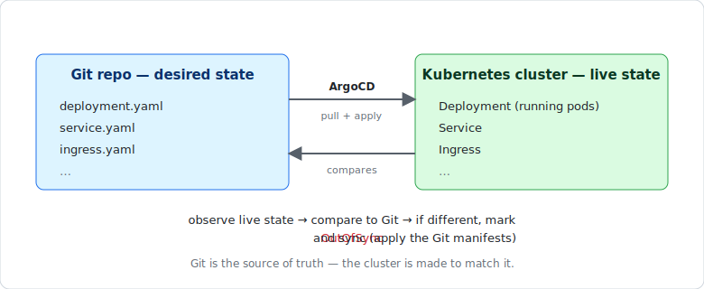
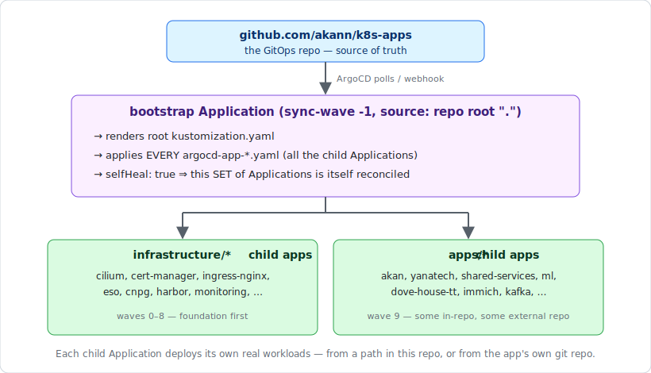
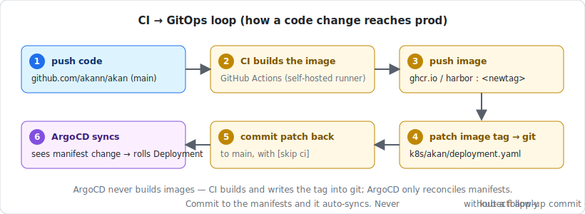

# How ArgoCD Works — and How It Works in This Setup

A reference for the GitOps engine behind the homelab cluster. Part 1 explains ArgoCD generally; Part 2 is specific to this `k8s-apps` repo.

---

## Part 1 — ArgoCD in general

### The core idea: Git is the source of truth

ArgoCD is a **GitOps continuous-delivery controller** that runs *inside* your Kubernetes cluster. Instead of a CI pipeline pushing changes *into* the cluster (`kubectl apply` from a runner), ArgoCD **pulls** the desired state from a Git repo and continuously makes the cluster match it.

<p align="center"></p>

The controller runs a loop: **observe** the cluster's live state → **compare** it to what Git says → if they differ, mark the app `OutOfSync` and (optionally) **sync** by applying the Git manifests.

### The `Application` — ArgoCD's unit of deployment

Everything ArgoCD manages is wrapped in an `Application` custom resource (CRD). An `Application` answers three questions:

| Field | Question | Example |
|-------|----------|---------|
| `source` | **What** to deploy and **from where** | repo `github.com/you/repo`, `path: k8s/myapp`, `targetRevision: HEAD` |
| `destination` | **Where** to deploy it | cluster `https://kubernetes.default.svc`, `namespace: myapp` |
| `syncPolicy` | **How** to keep it in sync | automated, self-heal, prune |

The `source` can be plain YAML, a Kustomize overlay, or a Helm chart — ArgoCD renders it to manifests, then applies them.

### Sync status vs. health status — two independent axes

ArgoCD tracks two things that people often conflate:

- **Sync status** — does the *live* cluster match *Git*? `Synced` / `OutOfSync`. This is purely a diff.
- **Health status** — are the deployed resources *actually working*? `Healthy` / `Progressing` / `Degraded` / `Missing`. A Deployment is `Healthy` when its pods are ready; an Ingress is `Healthy` when it has an address, etc.

An app can be `Synced` but `Degraded` (Git applied cleanly, but the pods are crash-looping), or `Healthy` but `OutOfSync` (running fine, but someone changed Git and it hasn't synced yet).

### `syncPolicy` — the knobs that make it automatic

```yaml
syncPolicy:
  automated:
    prune: true       # delete live resources that were removed from Git
    selfHeal: true    # revert manual cluster changes back to Git's version
  syncOptions:
    - CreateNamespace=true   # create the destination namespace if missing
    - ServerSideApply=true   # use server-side apply (better for large CRDs)
```

- **`automated`** — sync happens on its own when Git changes; you never click "Sync".
- **`selfHeal: true`** — this is the strict part. If you `kubectl edit` something ArgoCD manages, it gets **reverted** back to Git within minutes. Git wins, always. Drift is not allowed.
- **`prune: true`** — delete this resource line from Git and ArgoCD deletes it from the cluster. Without prune, orphaned resources linger.

### How it notices changes

By default ArgoCD **polls** Git every ~3 minutes. It can also be driven **instantly** by a repo webhook (a push triggers an immediate refresh) — which is why "commit → synced within seconds" is achievable. You can also force a refresh with an annotation or the UI/CLI.

### Scaling up: the app-of-apps pattern

Managing dozens of `Application`s by hand doesn't scale. Two common patterns solve this:

1. **App-of-apps** — one root `Application` whose *source* is a directory of **other `Application` manifests**. Sync the root, and it creates/manages all the child apps. The children then each deploy their own real workloads. Git is the single entry point for the whole cluster.
2. **ApplicationSet** — a controller that *generates* `Application`s from a template + a generator (e.g. "one app per subdirectory in `apps/*`"). Less boilerplate, but more magic.

This cluster uses **app-of-apps** (see Part 2).

### Sync waves — ordering dependencies

Within a sync, ArgoCD applies resources in **wave** order (annotation `argocd.argoproj.io/sync-wave: "N"`, lowest first, default 0). This lets you say "install the CNI and cert-manager *before* the apps that need them." Negative waves go earliest.

---

## Part 2 — ArgoCD in *this* setup (`k8s-apps`)

### The big picture

<p align="center"></p>

### The bootstrap Application (app-of-apps root)

`bootstrap/argocd-app-bootstrap.yaml` is the linchpin:

```yaml
kind: Application
metadata:
  name: bootstrap
  annotations:
    argocd.argoproj.io/sync-wave: "-1"   # runs before everything
spec:
  source:
    repoURL: https://github.com/akann/k8s-apps
    path: .                              # the repo ROOT kustomization
  syncPolicy:
    automated: { prune: true, selfHeal: true }
    syncOptions: [ ServerSideApply=true ]
```

Its source is the **root `kustomization.yaml`**, which is just a big ordered list of `argocd-app-*.yaml` files:

```yaml
resources:
  # Wave 0 — storage/network foundation
  - infrastructure/metallb/argocd-app-metallb.yaml
  - infrastructure/ceph-csi/argocd-app-ceph-csi.yaml
  # Wave 1 — CNI, ingress, TLS
  - infrastructure/cilium/argocd-app-cilium.yaml
  - infrastructure/cert-manager/argocd-app-cert-manager.yaml
  ...
  # Apps
  - apps/akan/argocd-app-akan.yaml
  - apps/shared-services/argocd-app-shared-services.yaml
  ...
```

**Consequence that trips people up:** because the bootstrap app has `selfHeal: true`, the *set of Applications itself* is continuously reconciled. If you `kubectl apply` an `Application` that isn't committed to git, the bootstrap app **silently reverts (deletes) it within minutes**. Likewise, to add a new app you must add its `argocd-app-<name>.yaml` line to the root `kustomization.yaml` and commit — a file sitting in a directory but not listed in the kustomization is never applied. (Confirmed behavior; see `CLAUDE.md` and `UPDATES.md 2026-07-03`.)

### Sync waves in this repo

The root kustomization's comment blocks encode a deliberate boot order, mirrored in the child apps' `sync-wave` annotations:

| Wave | Layer | Examples |
|------|-------|----------|
| -1 | bootstrap root | the `bootstrap` app itself |
| 0 | storage / L2 | metallb, ceph-csi |
| 1 | CNI, ingress, TLS | cilium, cert-manager, ingress-nginx |
| 2 | CRD-dependent config | metallb-config, cert-manager-config (ClusterIssuers) |
| 3 | cluster ops | reflector, reloader, kured, keda, argo-rollouts, network-policies |
| 4 | platform services | authentik, monitoring (kube-prometheus-stack), tempo, velero |
| 5 | observability / UI | loki, promtail, headlamp, redis, mongodb, minio, kong |
| 6 | secrets | external-secrets-operator (eso), infisical |
| 7 | databases | cnpg operator, cnpg clusters |
| 8 | registry / CI | harbor, actions-runner-controller, per-repo runner scale sets |
| 9 | the workload apps | akan, yanatech, shared-services, ml, dove-house-tt, … |

The ordering matters: e.g. **eso/infisical (wave 6)** must exist before app `ExternalSecret`s resolve; **cnpg (wave 7)** before any app that wants a Postgres cluster; **cert-manager + ingress (wave 1)** before anything needs TLS.

### Two flavors of app `source` in this repo

Child `Application`s split into two kinds:

1. **In-repo manifests** — `source.path` points at a directory *inside* `k8s-apps` (e.g. infrastructure apps, `apps/immich`, `apps/kafka`). The manifests live here.

2. **External app repo** — `source.repoURL` points at the *application's own* git repo. Example, `apps/akan/argocd-app-akan.yaml`:
   ```yaml
   source:
     repoURL: https://github.com/akann/akan.git   # NOT k8s-apps
     path: k8s/akan
   ```
   Here the `akan`, `yanatech`, `shared-services`, `ml`, and `dove-house-tt` apps keep their k8s manifests co-located in their own repos (`k8s/` folder), and the `Application` CRD in `k8s-apps` just *points* at them. ArgoCD watches the external repo directly.

This is why the workspace convention is "manifests live next to the app, but the `Application` that wires them into ArgoCD lives in `k8s-apps`."

### The CI → GitOps loop (how a code change reaches prod)

ArgoCD never builds images — it only reconciles manifests. Image building is CI's job. The full loop for an app like `akan`:

<p align="center"></p>

So the developer-facing rule (from `CLAUDE.md`): **commits to the manifests → ArgoCD auto-syncs within seconds. Never `kubectl apply` a manifest without a follow-up commit** — selfHeal will revert un-committed changes, and the next sync would clobber them anyway.

### `bootstrap.sh` vs. the bootstrap Application — don't confuse them

- **`bootstrap.sh`** is a *one-time, fresh-cluster* seeding script. On a brand-new cluster ArgoCD isn't yet managing itself, so the script `kubectl apply`s each `argocd-app-*.yaml` in wave order to get the flywheel spinning. **New app checklist:** if you add an app, add a matching `kubectl apply` line here *and* the entry in the root `kustomization.yaml`, or it won't come up on a rebuild.
- **The `bootstrap` Application** is the *ongoing* app-of-apps that keeps the whole set reconciled after the cluster is alive. This is what enforces "git is truth" day-to-day.

### Why app-of-apps here (and not ApplicationSet)

This repo deliberately uses the **explicit app-of-apps list** in the root `kustomization.yaml` rather than an `ApplicationSet` directory generator. The explicit list gives per-app control over `sync-wave` ordering, external `repoURL`s (each workload app can point at its own repo), and per-app sync options — expressiveness a single generator template can't match. (Two unused `ApplicationSet` manifests previously lingered in `bootstrap/`; they were never wired into the root kustomization and have been removed to avoid confusion.)

### Operating notes / gotchas

- **Adding an app:** create `apps/<name>/argocd-app-<name>.yaml` → add it to root `kustomization.yaml` (in the right wave) → add a `kubectl apply` line to `bootstrap.sh` → commit. Then it deploys and survives a cluster rebuild.
- **Manual changes get reverted.** `selfHeal: true` is on almost everywhere. To change live state, change git.
- **Forcing a re-sync:** bumping ArgoCD's refresh needs the annotation *value* to actually change to re-trigger (noted in the `ml` repo push workflow memory).
- **`CreateNamespace=true`** on most apps means you don't pre-create namespaces — the app's first sync makes them.
- **A manifest file that exists but isn't referenced** (by a kustomization `resources:` list or an app `path`) is invisible to ArgoCD. Missing-from-the-list is the most common "why didn't my change deploy" cause here.

---

### TL;DR

ArgoCD pulls desired state from git and continuously forces the cluster to match it. In this homelab, a single **`bootstrap` app-of-apps** (sync-wave -1) applies the root `kustomization.yaml`, which is an ordered, wave-partitioned list of every child `Application` — infrastructure first (waves 0–8), workloads last (wave 9). Each child app deploys manifests either from this repo or from the app's own external repo. CI builds images and patches image tags into git; ArgoCD does the rest. `selfHeal` means **git is the only way to change anything** — manual edits are reverted.
